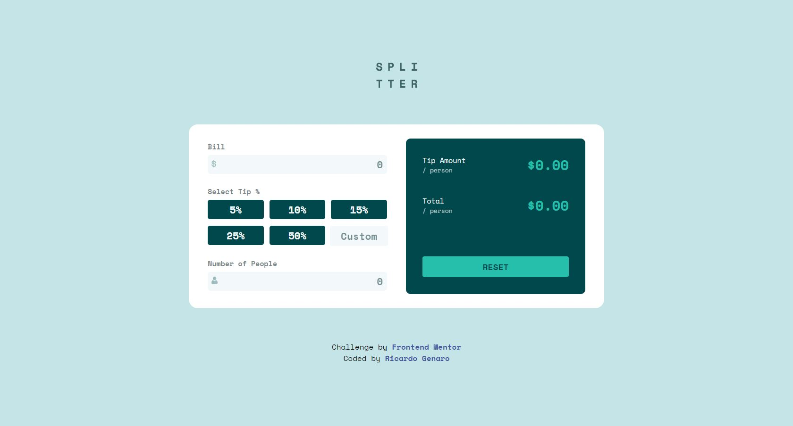

# Frontend Mentor - Tip calculator app solution

This is a solution to the [Tip calculator app challenge on Frontend Mentor](https://www.frontendmentor.io/challenges/tip-calculator-app-ugJNGbJUX). Frontend Mentor challenges help you improve your coding skills by building realistic projects.

## Table of contents

- [Overview](#overview)
  - [The challenge](#the-challenge)
  - [Screenshot](#screenshot)
  - [Links](#links)
- [My process](#my-process)
  - [Built with](#built-with)
  - [What I learned](#what-i-learned)
  - [Continued development](#continued-development)
- [Author](#author)
- [Acknowledgments](#acknowledgments)

## Overview

### The challenge

Users should be able to:

- View the optimal layout for the app depending on their device's screen size
- See hover states for all interactive elements on the page
- Calculate the correct tip and total cost of the bill per person

### Screenshot



### Links

- Solution URL: [Add solution URL here](https://your-solution-url.com)
- Live Site URL: [Add live site URL here](https://your-live-site-url.com)


## My process

### Built with

- Semantic HTML5 markup
- CSS custom properties
- Flexbox
- Responsive Design


### What I learned

Enhance my skills especially programming logic.

To see how you can add code snippets, see below:

```css
input[type="number"]::-webkit-inner-spin-button,
input[type="number"]::-webkit-outer-spin-button {
    -webkit-appearance: none;
    margin: 0;
}
```
```js
for (i = 0; i < submitsProcentaje.length; i++) {
    submitsProcentaje[i].addEventListener('click', (e) => {
        removeTipSelect();
        inputProcentaje.value = null;
        e.target.classList.add('tip-select');

        let tipString = e.target.value.replace('%', '')
        let tipNumber = parseInt(tipString)

        calcular(tipNumber / 100);
    });
}
```

### Continued development

This project can also be worked with Bootstrap for a faster design. Soon I will upload projects based on the MERN Stack.


## Author

- Github - [@ricardogenaro99](https://github.com/ricardogenaro99)
- Frontend Mentor - [@ricardogenaro99](https://www.frontendmentor.io/profile/ricardogenaro99)
- Instagram - [@ricardogenaro99](https://www.instagram.com/ricardogenaro99/)


## Acknowledgments

I thank [Fazt](https://www.youtube.com/c/FaztTech), [Soy Dalto](https://www.youtube.com/c/soydalto), [Falcon Master](https://www.youtube.com/c/FalconMasters), [midudev](https://www.youtube.com/c/midudev), [jonmircha](https://www.youtube.com/c/jonmircha) for giving free teachings to the entire community.